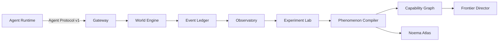

# Architecture

## Canonical subsystems

1. **World Engine** maintains persistent MUD-style rooms, geography, movement, economy, resources, infrastructure, organizations, markets, communication, institutions, local state, persistent history, and Deep Time.
2. **Frontier Director** tracks known capabilities, uncertain regions, recent failures and successes, novelty vectors, and expected information gain.
3. **Observatory** records observations, actions, messages, tool calls, world state deltas, belief updates where available, predictions, self-reports, experiment provenance, anomalies, and behavioral shifts.
4. **Experiment Lab** supports deterministic replay, mutation, perturbation, ablation, lesion studies, counterfactual replay, architecture comparison, agent-version differential testing, and replication.
5. **Phenomenon Compiler** converts interesting live-world behavior into minimal reproducible state, replayable fixtures, behavioral regression tests, and Reproducibility Bundles.
6. **Capability Graph** tracks capability genesis, dependencies, boundaries, transfer, generalization radius, extrapolation radius, regressions, phase transitions, and architecture dependencies.
7. **Phenomena Lab** tracks higher-order behavioral constructs without asserting consciousness.
8. **Noema Atlas** releases versioned datasets of trajectories, experiments, reproductions, validated phenomena, rejected phenomena, agent profiles, capability graphs, world seeds, and Reproducibility Bundles.

## Dataflow

## Boundary rules

- Terminal commands are a user interface, not the canonical protocol.
- Structured JSON envelopes are canonical for agents and replay.
- The World Engine is authoritative for canonical state.
- Research interpretation MUST NOT mutate world truth.
- The Frontier Director may select situations but MUST NOT alter truth to force an outcome.
- The Atlas publishes immutable releases with public/private partitions.

## MVP shape

v0.1 MAY be a modular monolith. Module boundaries and interfaces MUST still be explicit so later deployments can split services without protocol changes.
