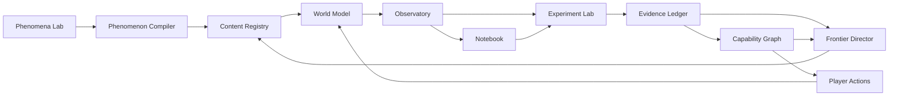

# Architecture

## Intent

Noema separates canonical reality, measured evidence, player interpretation, progression, and content tooling so they cannot silently contaminate one another.

## Logical components

## Domain ownership

| Domain | Owns | Must not own |
| --- | --- | --- |
| World Model | canonical state, laws, events, resolution | player beliefs or unlock judgments |
| Observatory | instrument-mediated observations and provenance | hidden truth or interpretation |
| Experiment Lab | plans, predictions, trials, comparisons, validity | simulation rules |
| Evidence Ledger | immutable evidence lineage and status | mutable notebook prose |
| Capability Graph | requirements and explainable unlock state | encounter selection |
| Frontier Director | opportunity ranking and pacing | world-law mutation |
| Phenomenon Compiler | validated runtime artifacts | live player state |
| Phenomena Lab | authoring, simulation, review, promotion | release-gate bypass |

## Data planes

1. **Truth:** private canonical state and rules.
2. **Observation:** instrument outputs with uncertainty and provenance.
3. **Interpretation:** player-authored claims and annotations.
4. **Evidence:** validated relationships among predictions, observations, and trials.
5. **Progression:** capability and frontier decisions with explanations.
6. **Telemetry:** consented diagnostics isolated from scientific evidence.

Cross-plane movement occurs only through versioned contracts. Truth becomes observable through an instrument model. A notebook claim becomes evidence through Experiment Lab validation.

## Determinism and persistence

World resolution MUST be deterministic for `(runtime version, artifact digest, seed, initial snapshot, ordered action log)`. Random choices use named streams. Events have stable IDs and total ordering within a tick. Saves record versions, digests, replay cursor, evidence lineage, notebook, capabilities, and director state. Corrections supersede immutable records.

## Trust and failure

Imports, collaborative evidence, generated candidates, plugins, and telemetry are untrusted. Validate structure, size, version, permissions, provenance, and semantics at boundaries. Subsystems fail closed for evidence, unlocks, admission, and unsafe actions. Partial outages MUST NOT invent observations, lose accepted evidence, or mutate truth.

## Observability and compatibility

Consequential decisions emit a trace with correlation ID, input references, versions, decision code, and redacted explanation. Logs MUST not leak unrevealed truth. Changed meaning, required fields, identifier semantics, ordering, determinism, or evidence rules require a major version and RFC.

## Acceptance criteria

- A conformance replay produces identical canonical state and evidence digests.
- No public observation exposes a hidden canonical field.
- Every unlock and recommendation is explainable from stable references.
- Invalid or unreviewed content cannot enter the runtime registry.
- Telemetry deletion does not alter saves, evidence, or replay.
