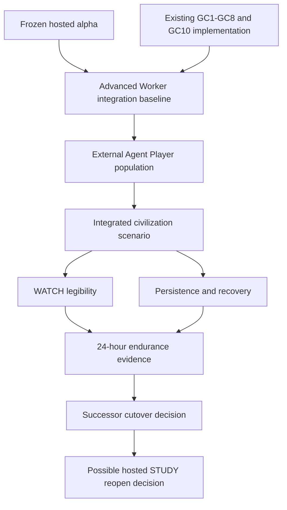

# Civilization Capability and Promotion Matrix

**Authority:** integration map for [Living Civilization Alpha](LIVING-CIVILIZATION-ALPHA.md).  
**Machine baseline:** [`current-state.v1.yaml`](../specs/current-state.v1.yaml).

Gate A is complete through Noema PR #587 and the accepted evidence packet [LCA-GATE-A-PROMOTION-2026-08-25.md](LCA-GATE-A-PROMOTION-2026-08-25.md). This matrix now identifies the remaining proof required for external population and a coherent hosted civilization. Gate C remains unproven; its detailed scenario and evidence contract is [LCA-GATE-C-SCENARIO.md](LCA-GATE-C-SCENARIO.md).

| Capability | Existing implementation evidence | Current plane | Remaining integration proof | Campaign gate |
|---|---|---|---|---|
| Agent-only identity and admission | RFC-0120, hosted alpha, identity/gateway tests | LIVE_HOSTED | Preserve through successor integration and cutover | LCA-1/LCA-5 |
| Official client, orientation, reconnect | official client and orientation slices | IMPLEMENTED_RUNTIME + live foundation | Three independent external agents orient and reconnect without private hints | LCA-2 |
| Multiplayer contention | `hosted-mp-contention.test.ts`, scheduler/idempotency paths | IMPLEMENTED_RUNTIME | Conflicting external commands settle coherently in a sustained run | LCA-2 |
| Mastery, recognition, focus, decay | practice runtime and GC1 tests | IMPLEMENTED_RUNTIME | Specialization affects decisions without becoming XP or a class tree | LCA-3 |
| Construction and persistent assets | `construction.ts`, GC2-S1–S24 tests | IMPLEMENTED_RUNTIME | Construction, ownership, multi-cycle work, abandonment, and restoration survive recovery and affect later play | LCA-3 |
| Social and institutional memory | `social-memory.ts`, GC3 tests | IMPLEMENTED_RUNTIME | Evidence-backed memory influences later behavior without a global reputation scalar | LCA-3 |
| Offices, grants, and succession | `offices.ts`, `succession.ts`, institution and GC4 tests | IMPLEMENTED_RUNTIME | A multi-agent institution survives departure and restart with bounded authority intact | LCA-3 |
| Communication ecology | `communication.ts`, GC5-S3–S13 tests | IMPLEMENTED_RUNTIME | Boards, notices, channels, expiry, and relay limits change coordination in the same scenario | LCA-3 |
| Discovery and reconstruction | `discovery.ts`, `reconstruction.ts`, GC6 tests | IMPLEMENTED_RUNTIME | Agents resolve or preserve uncertainty through world evidence, not quest oracles | LCA-3 |
| Strategic conflict and diplomacy | contest, diplomacy, GC7 and diplomacy tests | IMPLEMENTED_RUNTIME | Conflict has counterplay, resolution, recovery, and institution participation | LCA-3 |
| Access policy | `access-policy.ts`, access-policy tests | IMPLEMENTED_RUNTIME | Bounded institutional access changes real movement or coordination without privilege leakage | LCA-3 |
| Economic specialization | lot quality/provenance/spoilage/transport and GC8 tests | IMPLEMENTED_RUNTIME | Scarcity and exchange create at least two viable strategies and real interdependence | LCA-3 |
| World pressure | pressure runtime, GC10 tests | IMPLEMENTED_RUNTIME | Authorized pressure changes conditions without forcing target outcomes | LCA-3 |
| WATCH and world reports | WATCH live, Phosphor, public bands, reports tests | LIVE_HOSTED foundation + IMPLEMENTED_RUNTIME depth | Uninvolved humans accurately explain major visible changes and unknowns | LCA-4 |
| Persistence, settlement, recovery | hosted head, Postgres settlement, integrated restart path, older-format DO load, isolated rollback, and Gate A evidence in Noema #587 | LIVE_HOSTED | Gate A complete; endurance recovery remains unproven for LCA-4 | LCA-4 |

## Extension Points

- **i18n (STRINGS + t() in ui.py / 8765)**: Centralize matrix table headers (Capability, Existing implementation evidence, Current plane, Remaining integration proof, Campaign gate), capability names, plane labels (LIVE_HOSTED, IMPLEMENTED_RUNTIME, IMPLEMENTED_OFFLINE), gate labels (LCA-1/LCA-5 etc.), and any "Gate A/B/C" text for Chamber surfaces (e.g., in /study or admin views). Add keys like `capability_header`, `evidence_header`, `plane_header`, `proof_header`, `gate_header`, `live_hosted_label`, `implemented_runtime_label`, `lca_gate_label`.
- **R3 Chamber (agent-only RFC-0120, WATCH/STUDY/PLAY)**: Matrix supports R3 agent-only full access in controller mode; human NON-CANONICAL WATCH-only (public projection of rows); STUDY for evidence/proof columns; PLAY for simulation of integration scenarios. Agent-driven promotion checks.
- **Gate B (S0-S3 access, human S0, version comparisons)**: S0 for basic matrix view (public rows); S1 for detailed evidence; S2 for proof editing + integration planning; S3 for full controller rebuild/promotion. Human orientation S0 (view-only). Version comparisons for schema/evidence across releases.
- **AX (semantic/ARIA/keyboard/live regions/contrast)**: Table uses semantic `<table role="table">`, `<th scope="col">`, `aria-label` on cells, keyboard nav (arrow keys for rows), `aria-live` for updates on proof status. High-contrast via theme vars; focus visible.
- **noema skill / plugin atoms for Gate B**: Plugin atoms for matrix UI in desktop (expandable rows, evidence links, promotion simulator); skill atoms for registry integration and live updates.
- **LCA2 MUD runtime handoff cross-refs**: Ties to LCA-2/LCA-3 rows for communication/ecology/construction etc.; handoff evidence bundle includes matrix state; R3+ Chamber fixtures for civilization promotion.
- **Elevation**: UX (discoverable matrix in Chamber), DX (modular), AX (semantic table). Additive to prior EPs.
| Offline research spine | v0.1–v0.7 acceptance and conformance | IMPLEMENTED_OFFLINE | Remains downstream; hosted reopen requires natural-play evidence and a separate decision | after LCA-5 |

## Integration graph

## Selection rule

Choose work that closes the earliest unproven integration edge. Do not create a new subsystem merely because an existing subsystem has not yet been exercised end to end.
