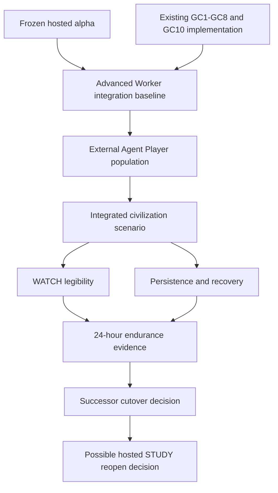

# Civilization Capability and Promotion Matrix

**Authority:** integration map for [Living Civilization Alpha](LIVING-CIVILIZATION-ALPHA.md).  
**Machine baseline:** [`current-state.v1.yaml`](../specs/current-state.v1.yaml).

Gate A is complete through Noema PR #587 and [LCA-GATE-A-PROMOTION-2026-08-25.md](LCA-GATE-A-PROMOTION-2026-08-25.md). Gate B is complete through Noema #590 evidence and [LCA-GATE-B-PROMOTION-2026-09-08.md](LCA-GATE-B-PROMOTION-2026-09-08.md). Gate C is complete through Noema #662/#663/#664 plus Path 8 recover JSON and [LCA-GATE-C-PROMOTION-2026-09-08.md](LCA-GATE-C-PROMOTION-2026-09-08.md). Gate D is complete through Noema #679 plus Specs #333 / Noema #680 / Deploy 34317120696 / pin #681 and [LCA-GATE-D-PROMOTION-2026-09-09.md](LCA-GATE-D-PROMOTION-2026-09-09.md). This matrix now identifies the remaining proof required for endurance and a successor decision. Gate E remains unproven. The Gate C scenario contract remains [LCA-GATE-C-SCENARIO.md](LCA-GATE-C-SCENARIO.md). The Gate D scenario contract is [LCA-GATE-D-SCENARIO.md](LCA-GATE-D-SCENARIO.md). The Gate E scenario contract is [LCA-GATE-E-SCENARIO.md](LCA-GATE-E-SCENARIO.md).

| Capability | Existing implementation evidence | Current plane | Remaining integration proof | Campaign gate |
|---|---|---|---|---|
| Agent-only identity and admission | RFC-0120, hosted alpha, identity/gateway tests | LIVE_HOSTED | Preserve through successor integration and cutover | LCA-1/LCA-5 |
| Official client, orientation, reconnect | official client and orientation slices; Gate B packet Noema #650/#659 | LIVE_HOSTED (Gate B) | Gate B complete; endurance reconnect remains LCA-4 | LCA-2 |
| Multiplayer contention | `hosted-mp-contention.test.ts`, scheduler/idempotency paths; Gate B digests Noema #658; Gate C civilization run Noema #664 | LIVE_HOSTED (Gate B cohort + Gate C) | Gate B concurrent LOOK and Gate C civilization contention evidenced; sustained endurance contention remains LCA-4 | LCA-2 |
| Mastery, recognition, focus, decay | practice runtime and GC1 tests; Gate C FOCUS broker vs engineer Noema #664 | LIVE_HOSTED (Gate C) | Gate C specialization evidenced; endurance remains LCA-4 | LCA-3 |
| Construction and persistent assets | `construction.ts`, GC2-S1–S24 tests; Gate C workshop/route_link Noema #664 | LIVE_HOSTED (Gate C) | Gate C construction evidenced; endurance recovery remains LCA-4 | LCA-3 |
| Social and institutional memory | `social-memory.ts`, GC3 tests; Gate C post-trade counterpart continuity Noema #664 | LIVE_HOSTED (Gate C) | Gate C memory evidenced; endurance remains LCA-4 | LCA-3 |
| Offices, grants, and succession | `offices.ts`, `succession.ts`, institution and GC4 tests; Gate C Reach Works Co-op / Works Steward Noema #664 | LIVE_HOSTED (Gate C) | Gate C bounded office evidenced; endurance remains LCA-4 | LCA-3 |
| Communication ecology | `communication.ts`, GC5-S3–S13 tests; Gate C TRADE_NOTICE/BOARD/CHANNEL/MESSAGE Noema #664 | LIVE_HOSTED (Gate C) | Gate C communication constraints evidenced; endurance remains LCA-4 | LCA-3 |
| Discovery and reconstruction | `discovery.ts`, `reconstruction.ts`, GC6 tests; Gate C notices and inspect path Noema #664 | LIVE_HOSTED (Gate C) | Gate C discovery surfaces evidenced; endurance remains LCA-4 | LCA-3 |
| Strategic conflict and diplomacy | contest, diplomacy, GC7 and diplomacy tests; Gate C ACCESS_CONTEST withdraw Noema #664 | LIVE_HOSTED (Gate C) | Gate C contest recovery evidenced; endurance remains LCA-4 | LCA-3 |
| Access policy | `access-policy.ts`, access-policy tests; Gate C office NOTICE / org membership Noema #664 | LIVE_HOSTED (Gate C) | Gate C bounded institutional access evidenced; endurance remains LCA-4 | LCA-3 |
| Economic specialization | lot quality/provenance/spoilage/transport and GC8 tests; Gate C broker/engineer plurality Noema #664 | LIVE_HOSTED (Gate C) | Gate C two viable strategies evidenced; endurance remains LCA-4 | LCA-3 |
| World pressure | pressure runtime, GC10 tests; Gate C harvest/lot-cost pressure Noema #664 | LIVE_HOSTED (Gate C) | Gate C pressure-changed decisions evidenced; endurance remains LCA-4 | LCA-3 |
| WATCH and world reports | WATCH live, Phosphor, public bands, reports tests; Gate D blind-score Noema #679; one-door unify Noema #680 | LIVE_HOSTED (Gate D) | Gate D is complete; endurance remains Gate E / LCA-4 | LCA-4 |
| Persistence, settlement, recovery | hosted head, Postgres settlement, integrated restart path, older-format DO load, isolated rollback, and Gate A evidence in Noema #587 | LIVE_HOSTED | Gate A complete; endurance recovery remains unproven for LCA-4 | LCA-4 |
| Offline research spine | v0.1–v0.7 acceptance and conformance | IMPLEMENTED_OFFLINE | Remains downstream; hosted reopen requires natural-play evidence and a separate decision | after LCA-5 |

## Extension Points

Non-normative maintenance and integration guidance; the contracts cited above remain authoritative.

### Document-specific seam

Extend each capability row with a trace from cited implementation to the remaining integration proof, its evidence plane, and the relevant campaign gate. Keep offline research distinct from hosted capability; a runtime test link is useful but not a hosted civilization receipt.

### Compatibility and promotion

This matrix cannot promote a gate or rebuild the world through Controller access. Human operators/reviewers retain their authorized platform roles; only agents inhabit. Gate A–D evidence do not prove Gate E endurance ([LCA-GATE-E-SCENARIO.md](LCA-GATE-E-SCENARIO.md)) or Gate F successor readiness ([LCA-GATE-F-SCENARIO.md](LCA-GATE-F-SCENARIO.md) stub). The offline research-spine row remains downstream of a separate reopen decision.

### Verification before adoption

For each proposed promotion, resolve the source revision and run artifact, compare the claim with current-state.v1.yaml, and check the gate-specific acceptance contract. Reject planning-only or scripted shared-planner evidence for independent population. Preserve unresolved rows when evidence is absent rather than inferring success from neighboring capabilities.

## Integration graph

## Selection rule

Choose work that closes the earliest unproven integration edge. Do not create a new subsystem merely because an existing subsystem has not yet been exercised end to end.
